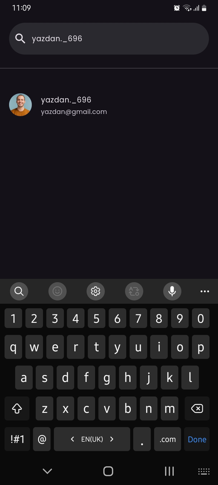

# Instagram Clone

A full instagram clone app

## Features

* **Real-time:** Follow and unfollow users in real-time using Firebase Firestore.
* **Real-time like and comments:** Like and write comments for users in real-time.
* **User authentication:** Authenticate users using Firebase Authentication.
* **User profiles:** View and edit user profile, including profile picture and name, username, bio.
* **Posts sharing:** Share images files in with firends.
* **Settings:** View and edit app settings, including theme and user account.
* **Activity:** See your newest info about your firends follow and unfollow or like and comments acts on your posts.
* **Comments:** Write a comment for friends to see in real-time.
* **Delete account:** Delete your account and all associated data.

## ScreenShots

|                               |                               |                               |
|-------------------------------|-------------------------------|-------------------------------|
|  |  |  |
|  |  |  |
|  |  |  ||  |  |  |

## Getting Started

To get started, follow these steps:

* 1- Clone the repository: git clone https://github.com/OracleMatrix/instagram_clone.git
* 2- Install dependencies: flutter pub get
* 3- Configure Firebase: Create a Firebase project and enable the Firestore and Authentication
services. Then, create a firebase_options.dart file in the lib directory with your Firebase
configuration.
* 4- get the google-services.json and put it in /android/app
* 5- Run the app: flutter run
**Note:** it's better after create project in your firebase console install flutterfire and run the
command "flutterfire configure" in your project path, there is lots of videos about flutterfire on
internet if you don't know!

### Code Structure

The code is organized into the following directories:

* lib: Contains the main application code.
* pages: Contains the different pages of the app, such as the home page and profile page.
* provider: Contains the Firebase provider, which handles Firebase authentication and data storage.
* services: Contains services for handling tasks such as saving users info and uploading media.

### Dependencies

The app uses the following dependencies:

* flutter: The Flutter framework.
* firebase_core: The Firebase Core SDK for Flutter.
* firebase_auth: The Firebase Authentication SDK for Flutter.
* cloud_firestore: The Firebase Firestore SDK for Flutter.
* firebase_storage: The Firebase Storage SDK for Flutter.
* provider: A state management library for Flutter.
* adaptive_theme: A library for adaptive themes in Flutter.
* google_fonts: A library for Google Fonts in Flutter.
* cached_network_image: A library for caching network images in Flutter.
* loading_animation_widget: A library for loading animations in Flutter.
* image_picker: A library for file picking in Flutter.
* and...

### Contributing

Contributions are welcome! If you'd like to contribute to the Instagram-clone App, please fork the
repository and submit a pull request with your changes.
